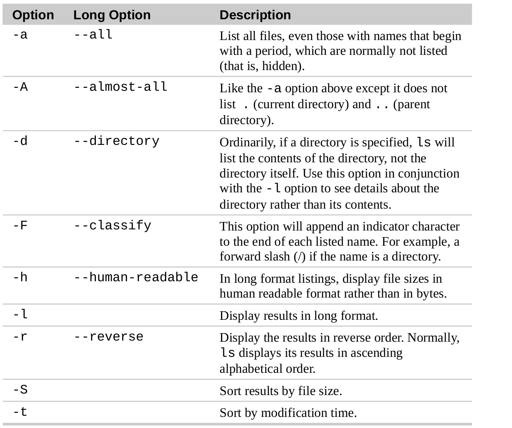

# Linux command line

## copy & paste

- highlight some text by holding down the left mouse button and dragging the mouse over it (or double clicking on a word)
- Press the middle mouse button

## traditional X behavior —“focus follows mouse”

a window gets focus just by passing the mouse over it.

## Ending a Terminal Session

- Ctrl-d.
- `exit`

## simple commands

- `date`
- `uptime`—  how long the system has been running and the average number of processes running over various periods of time
- `df` — see the current amount of **free space** on our disk drives
- `free` —  display the amount of **free memory**

## The Console Behind the Curtain

- Ctrl-Alt-F1 through Ctrl-Alt-F6
- Alt-F1 through Alt-F6.

---

## File system

- The first directory in the file system is called the root directory.
- Unix-like systems such as Linux **always have a single file system tree**, regardless of how many drives or storage devices are attached to the computer.
- `~` represents the home directory
- `pwd` — print working directory
- `ls`
- `cd`
    - `cd -`:  Changes the working directory to the previous working directory
    - `cd ~*user_name*`: Changes the working directory to the home directory of user_name.

## File names

- Filenames that begin with a period character(.) are hidden. This only means that `ls` will not list them unless you say `ls -a` .
- Filenames and commands in Linux, like Unix, are **case sensitive**
- Linux has no concept of a “file extension”
- Most importantly, do not embed spaces in filenames.

---

## More with `ls`

- `ls *directory*`  can specify multiple directories
- `ls -l`  long format
- `ls -i` displays inode number in the first field
- common options
    
    
    
- `ls -l` explanation
    
    
    

## `file *filename`*

 **When invoked, the file command will print a brief description of the file's contents.

## Viewing File Contents with `less`

- Once started, the less program allows us to scroll forward and backward through a text file.
- To exit less, press the q key.
- less commands
    
    
    

---

## wildcards

## Manipulating Files and Directories

- `mkdir directory...`
- `cp item1 item2`
- `cp item... directory`
- cp options
    
    
    
    
    
- `mv` performs both file moving and file renaming
    - `mv item1 item2`
    - `mv item... directory`
- `rm` Remove Files and Directories
    
    
    
- `ln` – Create Links
    - `ln *file link`*  hard link
    - `ln -s *item link`*  symbolic link

## Symbolic links

- if we write something to the symbolic link, the referenced file is written to.
- when we delete a symbolic link, only the link is deleted, not the file itself.
- If the file is deleted before the symbolic link, the link will continue to exist but will point to nothing. In this case, the link is said to be **broken**.

---

## Identifying Commands

- `type` – Display a Command's Type
- `which` – Display an Executable's Location
- `help` – Get Help for Shell Builtins
- `--help` – Display Usage Information
- `man` – Display a Program's Manual Page
    - On most Linux systems, man uses `less` to display the manual page, so all of the familiar `less` commands work while displaying the page.
- `apropos` – Display Appropriate Commands,  same with `man -k`
- `whatis` – Display One-line Manual Page Descriptions
- `info` – Display a Program's Info Entry

## Alias

- `alias name='string'`
- `unalias name`

---

## Redirecting Standard Output  `>`

- `ls -l /usr/bin > ls-output.txt`
- `ls -l /usr/bin >> ls-output.txt` Using the `>>` operator will result in the output being **appended** to the file. If the file does not already exist, it is created just as though the `>` operator had been used.
- **Group command:**  `{ command1; command2; command3; } > logfile.txt`
    - the shell requires whitespace around the braces
    - the final command in the sequence must be terminated with either a semicolon or a newline

## Redirecting Standard Error `2>`

- A program can produce output on any of several numbered file streams. While we have referred to the first three of these file streams as **standard input, output and error**, the shell references them internally as file descriptors 0, 1, and 2, respectively.
- `ls -l /bin/usr 2> ls-error.txt`

## Redirecting Standard Output and Standard Error to One File `&>`

- `ls -l /bin/usr &> ls-output.txt`
- `ls -l /bin/usr &>> ls-output.txt`

## Disposing of Unwanted Output

- This file is a system device often referred to as a bit bucket, which accepts input and does nothing with it. To **suppress error messages** from a command, we do this :
- `ls -l /bin/usr 2> /dev/null`

## Redirecting Standard Input

### reads one or more files and copies them to standard output

 `cat [*file*...]`

### create short text files

1. `cat > target.txt`
2. type in the message
3. ctrl-D

## pipe operator `|`

- the standard output of one command can be piped into the standard input of another
- `*command1* | *command2*`

## Filters

- `sort` sort lines of text files
- `uniq`  accepts a sorted list of data from either standard input or a single filename argument and, by default, **removes any duplicates** from the list.
- `uniq -d` only displays the duplicate  lines

## `wc` – Print Line, Word, and Byte Counts

 it prints out three numbers: lines, words, and bytes

`wc -l` only reports lines

## `grep` – Print Lines Matching a Pattern

`grep *pattern* [*file*...]` 

- -i, causes grep to **ignore case** when performing the search (normally searches are case sensitive)
- -l, causes grep to only **output the names of the files** containing text that matches the pattern.
- -v, causes grep to print only those lines that **do not match** the pattern.
- -w, causes grep to only **match whole words**.

## `head / tail` – Print First / Last Part of Files

- by default 10 lines
- `head -n 5` adjust by -n
- The -n option when used with `head`allows a **negative value** which causes all but the last n lines to be output. Similarly, the -n option with `tail` allows a **plus sign** causing all but the first n lines to be output.
- `head -n -5 text_header_footer.txt | tail -n +5 > text.txt`  Remove the first and last five lines
- `tail -f` continues monitor the file, and when new lines are appended, they immediately appear on the display

## `tee` – Read from Stdin and Output to Stdout and Files

The tee program reads standard input and copies it to both standard output (allowing the data to continue down the pipeline) and to one or more files.

- `ls /usr/bin | tee ls.txt | grep zip`
- this including tee to capture the entire directory listing to the file ls.txt before grep filters the pipeline's contents

## Arithmetic Expansion

`$((expression))`

`echo $(($((5**2)) * 3))`

## Brace Expansion

`echo Number_{1..5}`  Number_1 Number_2 Number_3 Number_4 Number_5

`echo {001..15}`

`echo {Z..A}`

`echo a{A{1,2},B{3,4}}b`    aA1b aA2b aB3b aB4b

## Command Substitution

`ls -l $(which cp)` Here we passed the results of `which cp` as an argument to the `ls` command, thereby getting the listing of the `cp` program without having to know its full pathname.

---

## cursor movement

## modify text

## Cut and paste

---

## Permission

`chmod xxx *filename*`

`chown` –  Change File Owner and Group

- `chown [owner][:[group]] file…`
- chown examples
    
    
    

 `chgrp` – Change Group Ownership

`groupadd` create a new group

`usermod -a -G *groupname username*` add a user to the group

---

## Process

`ps` view running process

`ps x` show all of our processes regardless of what terminal (if any) they are controlled by.

`ps aux` more detailed

`ps *pid*`

`top` displays a continuously updating (by default, every three seconds) display of the system processes listed in order of process activity

`*command* &`Putting a Process in the Background

`jobs` list active jobs

`fg %*jobspec*` move jobs to the foreground

`bg %*jobspec*` move jobs to the background

`nice -n 10 cpu-hog`  The `nice` command **launches a process with a specified niceness**

- Niceness adjustments are expressed from -20 (the most favorable) to 19 (the least favorable) with a default of value of zero (no adjustment)

`renice -n 19 379215`  The `renice` command adjusts the priority of a **running process.**

`kill [-signal] PID…`

`nohup command` when we close the terminal window, the process will continue running

`killall [-u user] [-signal] name...` 

`halt/poweroff/reboot` - Halt, power-off, or reboot the system

`shutdown` – Shutdown or reboot the system

